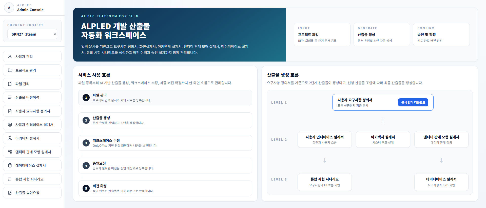
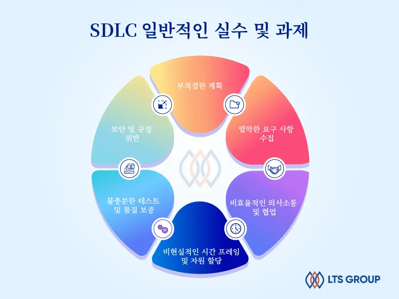
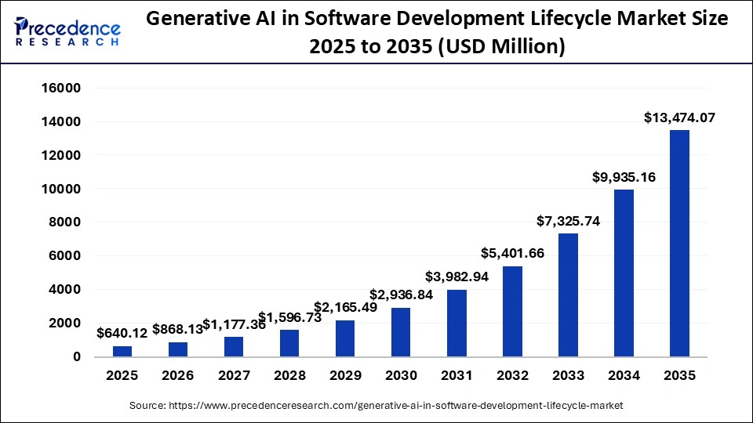
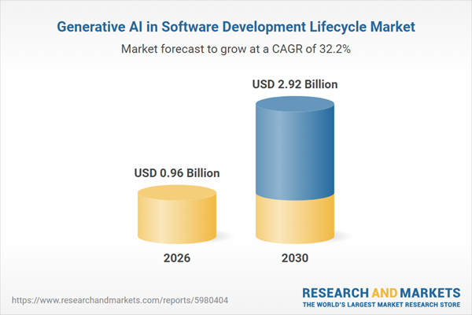
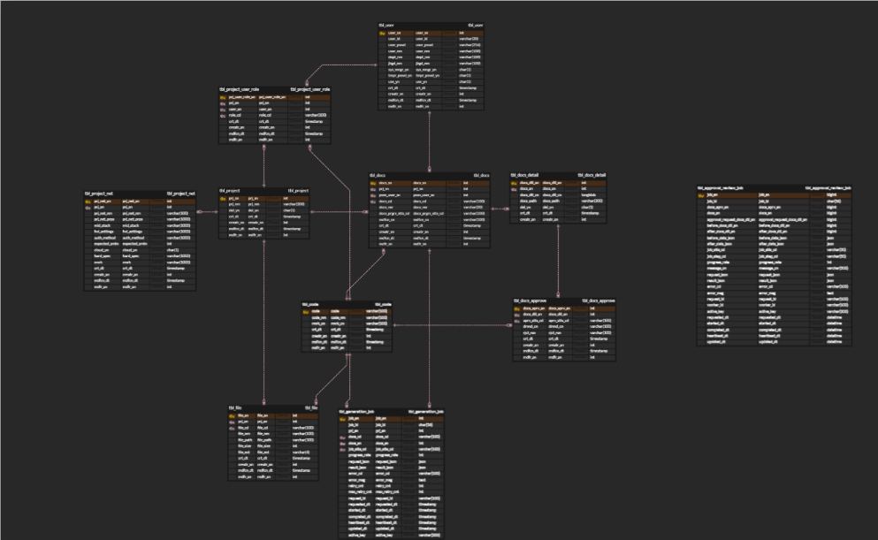

# SKN24-FINAL-3Team

**대주제**:
자체 sLLM 개발을 통한 기업 업무 활용 생성형 AI 플랫폼

**세부 주제**:
멀티 에이전트 기반 AI-DLC 문서 생성 자동화 플랫폼

**일정**: 2026.05.06 ~ 2026.06.30

## **1. 팀 소개**

## 팀명 : 다크나이트

## 팀원 소개

| 이름 | 담당 역할 |
|---|---|
| 권민세 |  |
| 김수진 |  |
| 김정현 |  |
| 박세현 |  |
| 정재훈 |  |
| 정준하 |  |

# **Contents**

1. [팀 소개](#1-팀-소개)
2. [프로젝트 개요](#2-프로젝트-개요)
3. [기술 스택](#3-기술-스택)
4. [모델 선정](#4-모델-선정)
5. [시스템 구성도](#5-시스템-구성도)
6. [WBS](#6-wbs)
7. [요구사항 명세서](#7-요구사항-명세서)
8. [화면 설계서](#8-화면-설계서)
9. [테스트 계획 및 결과 보고서](#9-테스트-계획-및-결과-보고서)
10. [서비스모델 성능 개선을 위한 노력](#10-서비스모델-성능-개선을-위한-노력)
11. [수행결과](#11-수행결과)
12. [한 줄 회고](#12-한-줄-회고)

     

---

## **2. 프로젝트 개요**

## **2.1 프로젝트 명 : `ALPLED`**

> : AI-dLc Platform for sLLM Enterprise Documentation
> `멀티 에이전트 기반 AI-DLC 문서 생성 자동화 플랫폼`

## **2.2 프로젝트 소개**

본 프로젝트는 **AI-DLC(AI 협업 소프트웨어 개발 방법론)**를 기반으로 소프트웨어 개발 생명주기에서 반복적으로 작성되는 주요 개발 산출물을 자동 생성 및 워크스페이스 내에서 수정하여 개발 산출물들을 관리하는 플랫폼입니다.
 

 

## **2.3 프로젝트 배경 및 필요성**

### **<h3> 2.3.1. 전통적인 SDLC의 한계** </h3>

- SDLC는 SI 프로젝트를 개발할때 필수적으로 사용하는 소프트웨어 개발 생명주기이며 성공적인 프로젝트 수행을 위해 단계별로 문서화되어야 함
 

- 전통적 SDLC(계획-분석-설계-개발-테스트)는 단계별 문서화에 과도한 시간이 소요되는 문제가 존재하며, 이로 인해 개발자들이 완료된 작업을 끊임없이 수정해야 하므로 마감일을 놓치고, 예산이 초과되고, 팀원들의 불만이 쌓이게 됨
 
 
       👉 소프트웨어 개발에서 AI를 활용하여 비즈니스 및 기술 리더들은 생산성 향상, 속도 증가, 실험 촉진, 출시 시간 단축, 개발자 경험 개선을 위해 끊임없이 노력하고 있음

### **<h3> 2.3.2. AI-DLC(AI Driven Development Lifecycle)** </h3>

- AI-DLC는 AI가 단순한 보조 도구를 넘어 소프트웨어 개발의 전 과정을 주도하는 차세대 방법론이며, AI-DLC는 기존 SDLC를 대체하는 완전히 새로운 개념이라기보다, AI Agent를 중심으로 개발 생명주기를 재구성한 구조임
 

- 기존 SDLC에서는 각 단계가 독립적으로 존재하고 사람이 이를 이어주었다면, AI-DLC에서는 하나의 컨텍스트를 기반으로 AI와 사람이 함께 흐름을 이어감
 

- AI-DLC는 인간을 배제하는 구조가 아니며 문제를 정의하고, 방향을 설정하고, 최종 의사결정을 내리는 역할은 여전히 인간에게 있음 
 

  👉 AI-DLC는 개발의 단위를 단계에서 흐름으로 바꾸고 주체를 인간 중심에서 Human + Agent 협업 구조로 확장하며 컨텍스트를 분절에서 지속으로 전환하는 개발 생명주기의 구조적 전환이라고 볼 수 있음
  

### **<h3> 2.3.3. AI-DLC 글로벌 시장 현황** </h3>

- 생성형 AI 시장의 규모 및 성장은 2025년 6.9억 달러에서 2026년 9.6억 달러 (성장률 38.6%)로 증가했고 2030년 29.2억 달러 (연평균 성장률 32.2%)로 전망
 

  👉 AI 기반 자동화된 테스트·QA 솔루션 도입, 생성형 AI 통합이 예측 기간 내 핵심 흐름으로 부상
 
 
  
- 전 세계 소프트웨어 개발 수명주기(SDLC)용 생성형 AI 시장 규모는 2026년 8억 6,813만 달러에서 2035년 약 134억 7,407만 달러로 증가 전망
 

  👉 기업들이 효율성과 생산성 향상을 위한 혁신적인 솔루션을 점점 더 많이 모색함에 따라 시장은 견조한 성장세를 보일 것으로 예상
  
---

## **2.4 프로젝트 목표**

### **[1] Work Efficiency: 업무 효율화**

> **목표:** RFP와 회의록을 기반으로 CBD 표준 산출물 생성을 자동화하여 반복적인 SW 개발 문서 작업 부담을 줄임

- **AI 기반 공공 SI 산출물 자동 생성 플랫폼**: 제안요청서와 회의록을 분석하여 사용자 요구사항 정의서, 인터페이스 설계서, 아키텍처 설계서, ERD 설계서, DB 설계서, 통합시험 시나리오 등 표준 산출물을 자동 생성함
    - **[한계 극복]**
        - 반복적으로 수행되던 문서 작성·수정 작업을 **LLM 기반 에이전트 워크플로우**로 자동화함
        - 산출물 작성 시간을 단축하고, 개발자와 기획자가 핵심 검토 업무에 집중할 수 있는 업무 환경을 제공함

### **[2] Quality Improvement: 품질 향상**

> **목표:** 요구사항 기반 산출물 간 정합성 검증을 통해 누락·불일치를 줄이고 설계 품질을 향상함

- **요구사항 추적 기반 산출물 검증 구조**: 사용자 요구사항 정의서를 기준으로 후속 산출물의 구성 요소, 관계, 테이블, 컬럼, 테스트 시나리오가 일관되게 반영되었는지 검증함
    - **[한계 극복]**
        - 수작업 문서 작성 과정에서 발생하는 요구사항 누락, 중복, 불일치 문제를 **정합성 검증 로직**으로 보완함
        - 산출물 간 연결성을 유지하여 공공 SI 문서의 검토 품질과 재사용성을 높임

### **[3] Cost Reduction: 비용 감소**

> **목표:** 외부 대규모 LLM API 의존도를 낮추고, 로컬·전용 모델 기반 생성 구조로 운영 비용을 절감함

- **sLLM 기반 산출물 생성 환경**: Qwen 계열 모델과 파인튜닝 어댑터를 활용하여 요구사항 생성과 문서 보강 작업을 수행함
    - **[한계 극복]**
        - 대규모 상용 LLM API 호출 비용과 외부 서비스 의존도를 줄이고, 기업 내부 환경에서도 운영 가능한 구조를 마련함
        - RunPod 및 로컬 모델 서버 기반 실행으로 실험·배포 비용을 유연하게 조절할 수 있음

### **[4] Security Enhancement: 보안성 강화**

> **목표:** 내부 문서와 프로젝트 정보가 외부 API로 전송되는 위험을 줄이고, 폐쇄망 환경 적용 가능성을 확보함

- **내부 배포 가능한 AI 문서 생성 구조**: 외부 API 사용을 최소화하고, 로컬 모델 서버와 내부 Vector DB를 활용하여 문서 생성 및 RAG 보강을 수행함
    - **[한계 극복]**
        - 공공기관·기업의 민감한 제안요청서, 회의록, 설계 문서가 외부로 유출될 가능성을 최소화함
        - Qdrant 기반 내부 참조 데이터와 sLLM을 활용하여 폐쇄망 또는 제한망 환경에서도 활용 가능한 AI-DLC 기반 플랫폼을 구현함

## 3. 기술 스택

|        분류         | 기술/도구 |
| :-----------------: | :------------------------------------------------------------------------------------------------------------------------------------------------------------------------------------------------------------------------------------------------------------------------------------------------------------------------------------------------------------------------------------------------------------------------------------------------------------------------------------------------ |
|    **Language**     |    |
|   **Backend**       |    |
|    **Frontend**     |    |
|    **LLM & AI**     |     |
|  **AI Workflow**    |  |
|    **Vector DB**    |   |
|    **Database**     |    |
| **Cloud / Storage** |    |
| **Document / Image** |     |
| **Data Processing** |   |
|     **DevOps**      |    |
|  **Collaboration**  |   |

---

## 4. 모델 선정

### 임베딩 모델

| 항목 | BAAI/bge-m3 ⭐ | Qwen/Qwen3-Embedding-0.6B | intfloat/multilingual-e5-large-instruct |
| --- | :---: | :---: | :---: |
| 검색 정확도 Recall@K | 0.78 | 0.74 | 0.71 |
| 검색 순위 품질 MRR | 0.69 | 0.65 | 0.62 |
| 검색 결과 관련성 Precision@K | 0.61 | 0.58 | 0.55 |
| 임베딩 생성 속도 Embedding Latency | 0.052s | 0.041s | 0.057s |
| 배포 효율성 Model Size | 2.2GB | 1.2GB | 2.1GB |

- **BAAI/bge-m3 선택 이유**: RAG 검색 성능 평가에서 Recall@K, MRR, Precision@K가 모두 가장 높게 나타나 요구사항과 관련 근거 문서를 가장 안정적으로 검색할 수 있다고 판단함. ALPLED는 제안요청서, 비기능 요구사항, 표준 가이드 문서를 기반으로 산출물을 보강해야 하므로, 단순 속도보다 검색 정확도와 검색 결과의 관련성을 우선하여 **BAAI/bge-m3**를 선정함.

---

### LLM 모델

| 항목 | Qwen3-VL-8B-Instruct ⭐ | Qwen2.5-VL-7B-Instruct | Llama-3.2-11B-Vision-Instruct | MiniCPM-V-4.5 |
| --- | :---: | :---: | :---: | :---: |
| 멀티모달 입력 이해 Image QA Accuracy | 0.76 | 0.73 | 0.68 | 0.72 |
| 문서 산출물 생성 품질 BERTScore | 0.812 | 0.795 | 0.773 | 0.781 |
| 근거 반영 및 추론 정확도 RAGAS | 0.71 | 0.68 | 0.62 | 0.65 |
| 구조화 출력 준수율 Schema Match Rate | 0.83 | 0.79 | 0.71 | 0.76 |
| 추론 속도 Average Latency | 12.8s | 11.2s | 15.9s | 9.6s |

- **Qwen3-VL-8B-Instruct 선택 이유**: 문서 산출물 생성 품질, 근거 반영 정확도, 구조화 출력 준수율이 비교 모델 중 가장 우수하게 나타남. ALPLED는 사용자 요구사항 정의서, 인터페이스 설계서, 아키텍처 설계서 등 정형 산출물을 생성해야 하므로, 단순 추론 속도보다 실제 산출물이 얼마나 정확하고 안정적으로 생성되는지를 우선하여 **Qwen3-VL-8B-Instruct**를 선정함.

## 5. 시스템 아키텍처

## 5.1. ERD

## 6. WBS
[WBS](https://drive.google.com/file/d/1GexfIF200kazt--7p8Y_9_unNBqGNcEq/view)
## 7. 요구사항 명세서
[요구사항 명세서]( https://drive.google.com/file/d/1u4lXpHCEdzL4BWZ9JUSXrgniPfX2l5X-/view)

## 8. 화면 설계서
[화면 설계서](https://drive.google.com/file/d/1dsYRLhlAViEpEZvITHu3XkqBcuFsZD_-/view)

## 9. 테스트 계획 및 결과 보고서
[테스트 계획 및 결과 보고서](https://drive.google.com/file/d/1uB1gkUaUf935MfTbedQ-kZDzgOW14FA1/view)
## 10. 서비스모델 성능 개선을 위한 노력

### ☑️ 주요 개선 사항 1 : Supervisor Node 기반 멀티에이전트 오케스트레이션

**[Solution] 산출물 유형과 생성 상태를 판단하여 전문 에이전트를 자동 분기하는 생성 워크플로우 구축**

AIDLC는 단일 LLM 호출 방식의 한계를 개선하기 위해 **Supervisor Node 중심의 멀티에이전트 오케스트레이션 구조**를 적용하였다.
Supervisor Node가 사용자의 생성 요청, 산출물 유형, 현재 진행 상태를 판단하고, 요구사항 명세서·인터페이스 정의서·테스트 시나리오·아키텍처 설계서 등 산출물별 전문 에이전트를 호출하도록 구성하였다.

* **산출물별 전문 에이전트 분리** : 산출물마다 요구되는 형식과 생성 목적이 다르므로, 각 산출물에 특화된 에이전트를 분리하여 생성 품질을 향상시킴
* **Supervisor Node 기반 흐름 제어** : 문서 병합, 산출물 생성, 이미지 분석, 아키텍처 분석, Mermaid 생성, 검증, 저장 과정을 단계별로 제어함
* **생성 상태 추적 및 오류 대응 강화** : 각 단계의 실행 결과를 상태값으로 관리하여 생성 실패 지점과 검증 결과를 추적할 수 있도록 개선함

---

### ☑️ 주요 개선 사항 2 : 파인튜닝 기반 요구사항 생성 품질 개선

**[Solution] 요구사항 분해·병합·정규화에 특화된 학습 데이터 구축을 통한 SLLM 성능 개선**

일반 LLM은 RFP의 복합 요구사항을 개발 산출물에 적합한 단위로 분해하거나, 유사·중복 요구사항을 정리하는 데 한계가 있다.
이를 개선하기 위해 AIDLC는 요구사항 생성에 특화된 GOLD DATASET을 구축하고, 요구사항 분해·중복 병합·문장 정규화·표준 양식 변환 과정을 학습하도록 파인튜닝을 진행하였다.

* **요구사항 분해 성능 개선** : 긴 문장, 표, 목록, 복합 요구사항을 기능 단위로 적절히 분리하도록 학습함
* **중복 요구사항 병합 개선** : 의미가 유사한 요구사항을 하나의 명확한 요구사항으로 정리하여 산출물의 중복을 줄임
* **CBD 표준 양식 정규화** : 요구사항명, 요구사항 상세내용, 출처 정보 등을 일관된 형식으로 생성하도록 개선함

---

### ☑️ 주요 개선 사항 3 : RAG 기반 근거 참조 및 산출물 정합성 강화

**[Solution] RFP·회의록·기술표준·규정·비기능 요구사항명세를 활용한 근거 기반 생성 구조 구축**

LLM이 입력 자료에 없는 내용을 임의로 생성할 경우 산출물의 신뢰도가 낮아질 수 있다.
이를 개선하기 위해 AIDLC는 RAG 구조를 적용하여 RFP, 회의록, 기존 산출물뿐만 아니라 **기술표준, 관련 규정, 비기능 요구사항명세**를 참조한 근거 기반 생성이 가능하도록 구성하였다.

* **입력 문서 기반 생성 강화** : RFP와 회의록의 핵심 내용을 검색·참조하여 사용자가 제공한 자료와 관련성 높은 산출물을 생성함
* **기술표준 및 규정 반영** : 보안, 접근성, 데이터 관리, 시스템 운영 등 산출물 작성 시 필요한 표준과 규정을 참조하여 문서 품질을 높임
* **비기능 요구사항 반영** : 성능, 보안, 확장성, 가용성, 운영성 등 비기능 요구사항을 후속 산출물 생성 과정에 반영함
* **산출물 간 정합성 확보** : 요구사항 명세서를 기준으로 아키텍처 설계서, 인터페이스 정의서, 테스트 시나리오를 생성하여 산출물 간 내용 불일치를 줄임

---

### ☑️ 주요 개선 사항 4 : 실제 서비스 운영을 위한 배포 환경 구축

**[Solution] Web·API·DB·Storage 연동을 통한 산출물 생성 서비스 운영 구조 구현**

AIDLC는 단순 모델 테스트에 그치지 않고, 사용자가 실제로 프로젝트를 생성하고 파일을 업로드한 뒤 산출물을 생성·수정·검토·승인·다운로드할 수 있는 서비스 환경을 구축하였다.
이를 통해 AI 모델의 결과물이 실제 업무 흐름 안에서 활용될 수 있도록 서비스 완성도를 높였다.

* **Web과 AI Agent 서버 연동** : Django 기반 웹 서비스와 FastAPI 기반 AI Agent 서버를 연동하여 사용자 요청이 실제 산출물 생성 프로세스로 전달되도록 구성함
* **DB 및 파일 저장 구조 구축** : 프로젝트 정보, 업로드 파일, 생성 산출물, 진행 상태, 버전 이력 정보를 DB와 Storage에 저장하도록 구현함
* **검토·승인·버전관리 프로세스 적용** : 생성된 산출물을 미리보기로 확인하고, 수정하기, 검토요청, 승인, 버전이력 관리까지 이어지는 실제 업무 프로세스를 반영함
* **산출물 다운로드 및 이력 관리 지원** : 최종 승인된 산출물과 이전 생성 결과를 관리하여 프로젝트 산출물의 추적성과 재사용성을 높임

## 11. 수행결과
[시연영상](https://drive.google.com/file/d/1fwwHMRIUXacZywl-572xzIK7LrnTVQaO/view?usp=sharing)

## 12. 한 줄 회고

| **이름** | **회고 내용**                                                                                                                                                                                                                                                                                                                                                                                                                                                                                                                                                                                                                                               |
| :------- | :---------------------------------------------------------------------------------------------------------------------------------------------------------------------------------------------------------------------------------------------------------------------------------------------------------------------------------------------------------------------------------------------------------------------------------------------------------------------------------------------------------------------------------------------------------------------------------------------------------------------------------------------------------- |
| 권민세   |  ㅇ |
| 김수진   |  ㅇ |
| 김정현   |  ㅇ |
| 박세현   |  ㅇ |
| 정재훈   |  ㅇ |
| 정준하   |  ㅇ |

